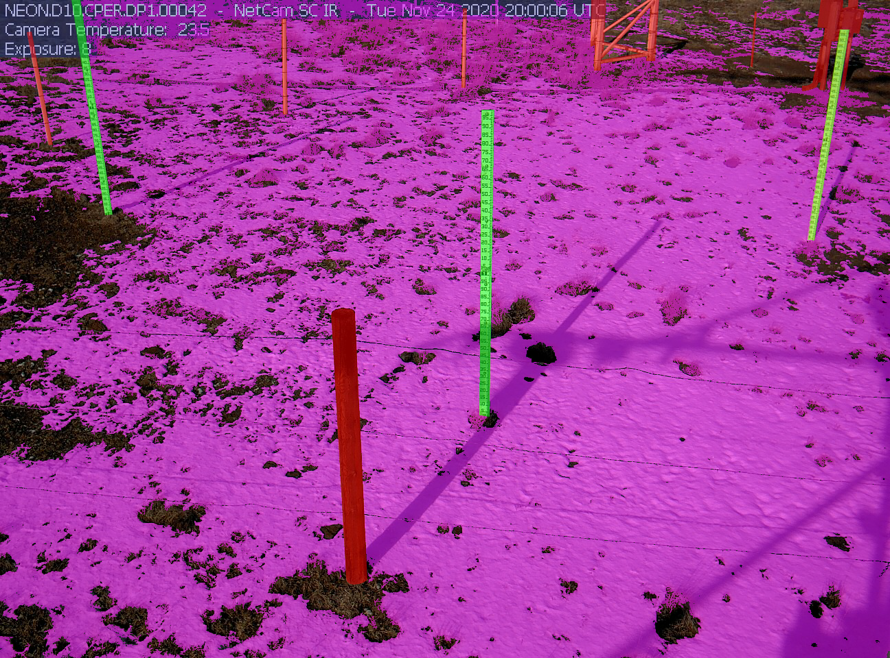

# NEON Snow Segmentation Dataset

This is the start of a small dataset to help develop and validate snow segmentation methods.

We're currently labelling the snow, snow sticks and background objects in the scene. Here's an example:

The images are labelled using the following colors:

* Background objects: `rgb(255, 0, 0)`
* Snow sticks: `rgb(0, 255, 0)`
* Snow: `rgb(255, 0, 255)`

## Citations

All images are from the [NEON Snow depth and understory phenology image data](https://data.neonscience.org/data-products/DP1.00042.001).

1. NEON (National Ecological Observatory Network). Snow depth and understory phenology images (DP1.00042.001). https://data.neonscience.org (accessed March 24, 2021)
